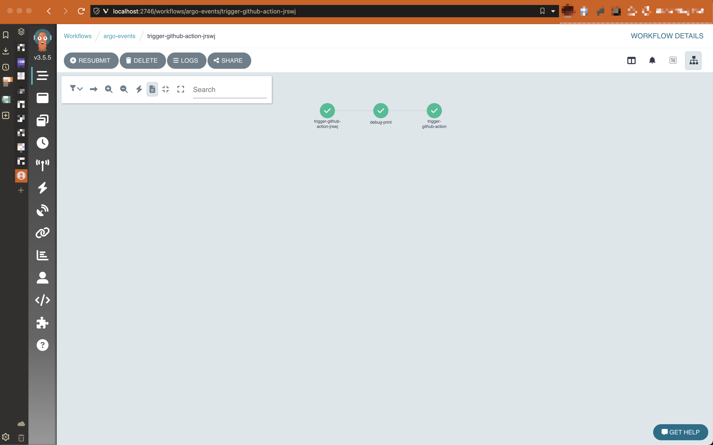
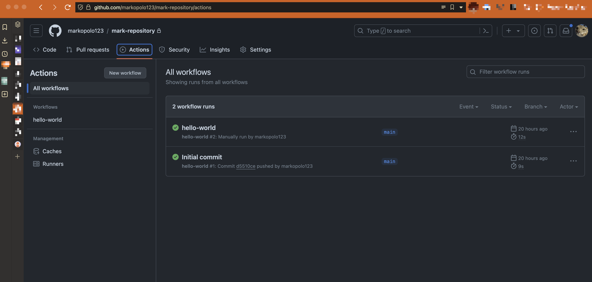

# crossplane-argo-demo

demo for using Crossplane with argo events, kyverno and Argo Workflows

## Goal

Build a system for allowing creation of gatekeeped Github Repositories, with automated triggering of a `Github Action` workflow in the new repository. 


## Prerequisites

> You will some local container tooling for kind to work, like docker desktop or orbstack.

Flox is used to make this demo simple to run.

```bash
Flox activate
```

If you are not into `nix` or `flox` you may get started by installing the following tools:

* [kubectl](https://kubernetes.io/docs/tasks/tools/)
* [helm](https://helm.sh/docs/intro/install/)
* [task](https://taskfile.dev/#/installation)
* [kyverno](https://kyverno.io/docs/installation/)
* [kind](https://kind.sigs.k8s.io/docs/user/quick-start/)
* [envsubst](https://www.gnu.org/software/gettext/manual/html_node/envsubst-Invocation.html)

Optional:
* [direnv](https://direnv.net/docs/installation.html)

### Create a GitHub Fine-Grained Personal Access Token

Use [this](https://docs.github.com/en/authentication/keeping-your-account-and-data-secure/managing-your-personal-access-tokens) guide to create a token.

It will need permissions to be able to create repositories and trigger workflows.

Once you have the token, export it as an environment variable along with your Github username (or organization name):

```bash
export GITHUB_TOKEN=token-goes-here)
export GITHUB_USERNAME=github-username-or-org
export ARGO_GITHUB_TOKEN=$(echo -n "Bearer $GITHUB_TOKEN" | base64)
```

This demo subsitutes these values into the manifests using `envsubst` .

## Setup

```bash
task create <- creates the Kind cluster
task bootstrap <- Installs required tools and components
task post-bootstrap <- Configures the controllers
```

## Usage

Optionally you may now setup some kyverno policies:

```bash
kubectl apply -f kyverno/repo-mutate-policy.yaml <- this will mutate the repository visibility to private
kubectl apply -f kyverno/repo-names-policy.yaml <- this will enforce a naming convention
```

Now you are ready to create a new repository using an example template repository:

```bash
kubectl apply -f crossplane/repo-no-validation.yaml
```

You can port forward the Argo Workflow UI to see the workflow in action:

> Note that auth is disabled in the UI in this demo

```bash
kubectl -n argo-events port-forward deployment/argo-server 2746:2746
```

Open your browser to `http://localhost:2746` and you should see the workflow running.



And in your new repository you should see the workflow running:


